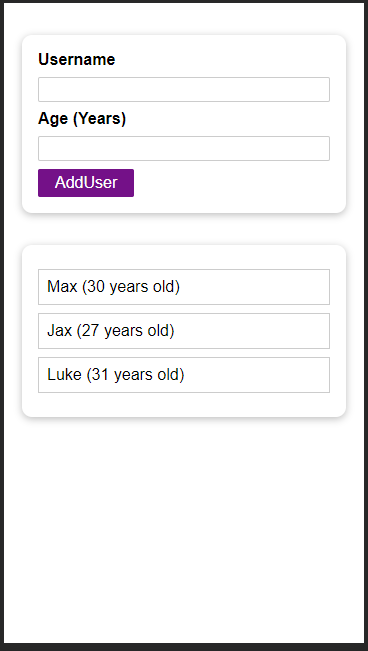
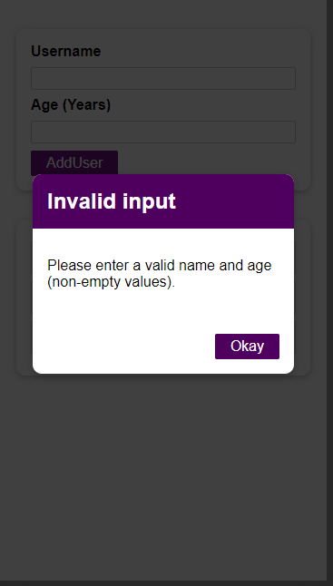

# A Dummy Practice Lists and Keys in ReactJS


## Getting Started

Start by cloning the project and extract files. Then open bash or CLI, navigate to the folder contains the project and type

```
npm install
```

This is just an example application.

### Screen Shots
<div style="display: inline">
  
   
<div/>

### Building the Application

Start build the application by using command:

```
npm start
```
